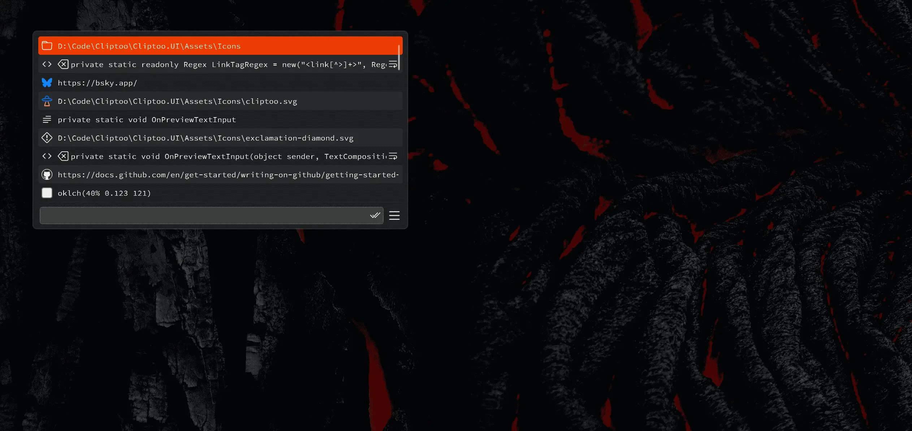
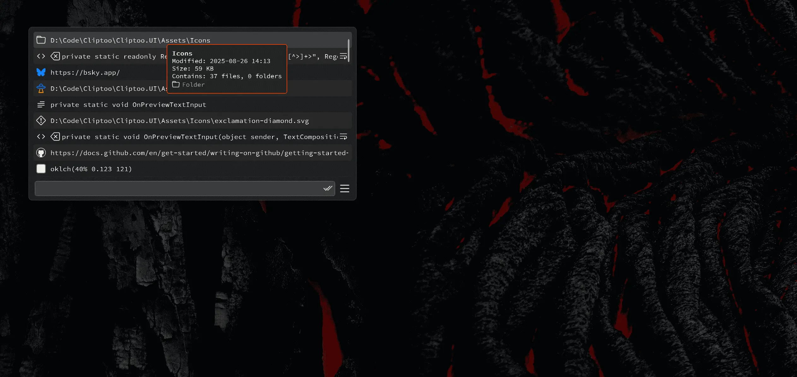
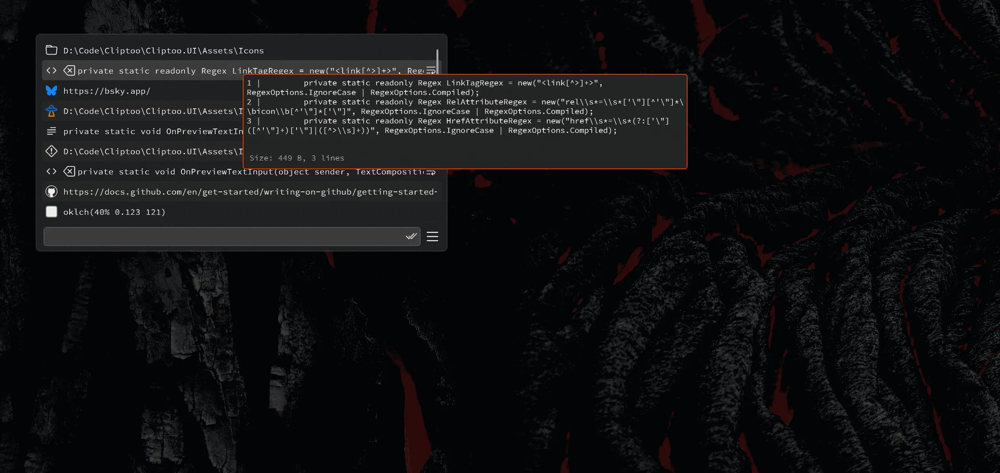
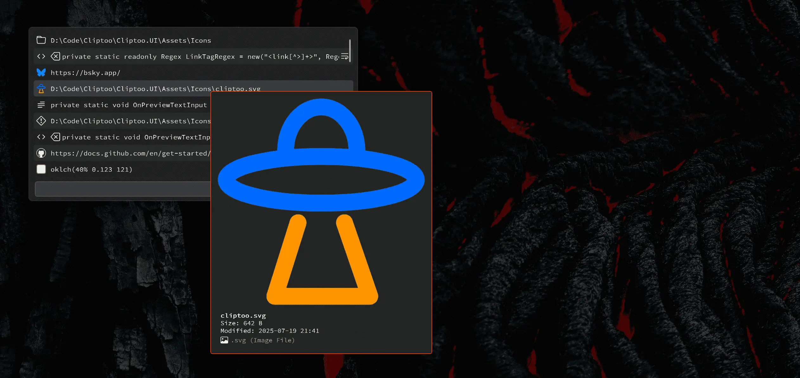
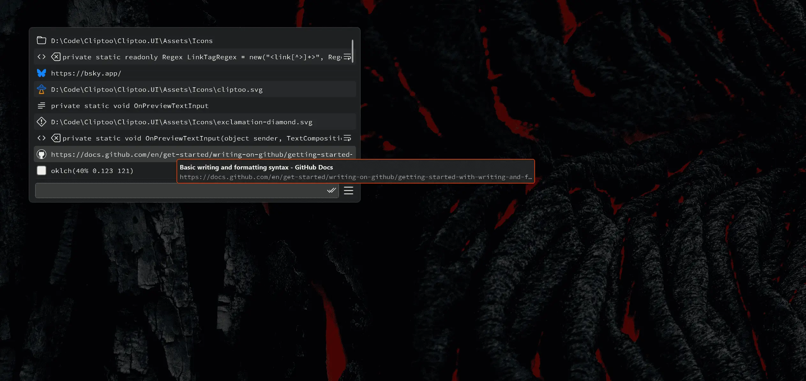
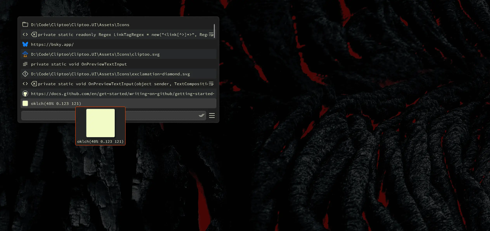
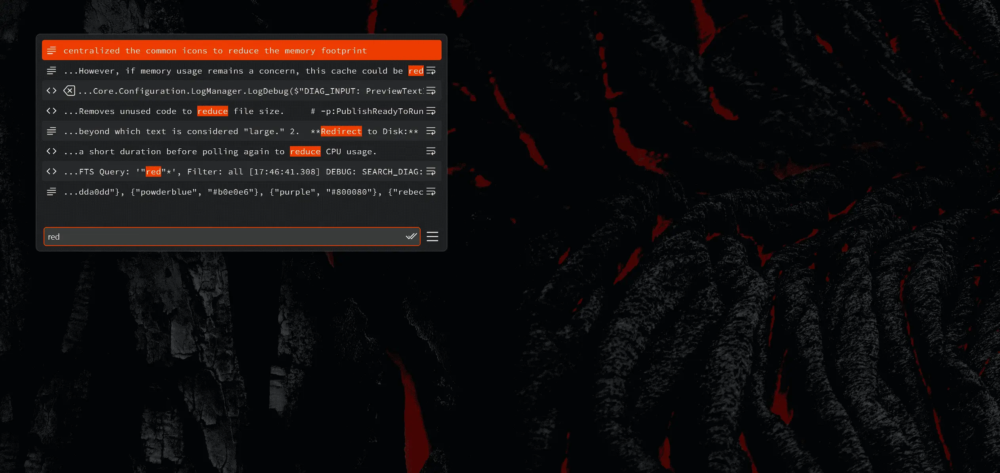
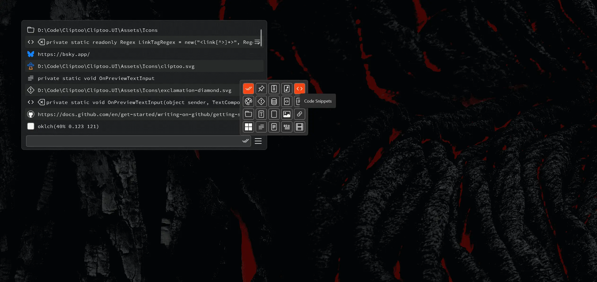
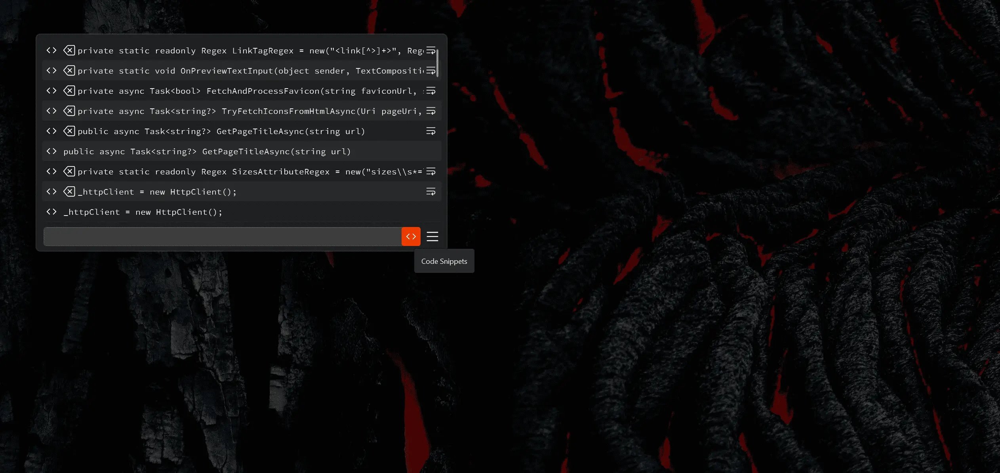
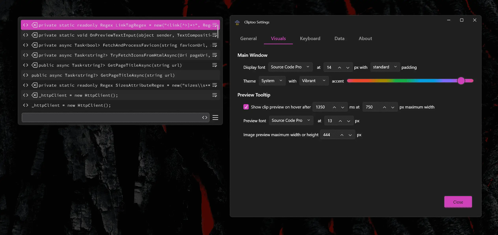

#  Cliptoo: The Advanced Clipboard Manager

Cliptoo is a high-performance clipboard manager for Windows, filled with the features you need - as well as some you didn't know you needed.

It has been carefully designed to remain performant whether you have 10 clips or 10,000 saved. With the fuzzy search and filter system, you can easily find the clip you need, and confirm it with preview tooltip for text, colors, images, URLs, etc.

Cliptoo will turn your clipboard history in to a quick-access library of the things you need.

> [!NOTE]
> For now, there is only a build for x64 Windows systems.

[Download the latest release of Cliptoo](https://github.com/dcog989/Cliptoo/releases/latest).

---

## Screenshots

## Features

### Advanced Clipboard Management

- **Persistent History:** Never lose a copied item again. Your history is stored locally in a high-performance SQLite database.
- **Full-Text Search:** Find clips with a powerful, fuzzy search engine that highlights matches in real-time.
- **Content-Aware Filtering:** Filter your history by type: text, links, images, colors, favorite items, etc.
- **Favorites:** Keep frequently used items, make them favorite to avoid auto-cleanup.
- **Virtualized Scrolling:** Scroll through thousands of clips with no performance degradation.

### Content-Aware Previews

- **Image Previews:** Hover to see thumbnails and detailed previews for all common image formats, including `.svg`, `.webp`, and `.jxl`.
- **Color Swatches:** Color codes (`#hex`, `rgb()`, `hsl()`, `oklch()`) are displayed as color swatches - with transparency support.
- **Code Snippet Highlighting:** Code blocks are automatically identified and syntax-highlighted in the built-in editor.
- **Web Link Metadata:** Fetches favicons and page title for web links.
- **File & Folder Information:** See file size, modification date, type information for file-based clips and number of files / folders for the folder preview.

### Powerful Tools & Integrations

- **Quick Paste:** Hold a modifier key (e.g., `Ctrl+Alt`) to overlay numbered shortcuts on your clips for keyboard pasting.
- **Text Transformations:** Transform and paste text clips with e.g.:
  - Case changes: `UPPER`, `lower`, `Capitalize`, `Sentence case`, `iNVERT`.
  - Whitespace control: `Trim`, `Remove Line Feeds`.
  - Code formatting: `kebab-case`, `snake_case`, `CamelCase`.
- **"Send To" Integration:** Add as many external programs as you like and send your clips to them.
- **Text Compare:** Cliptoo auto-detects your compare program, or you can add one manually then send clips to it.

### Deep Customization

- **Modern Theming:** Choose between Light, Dark, or sync with the Windows system theme.
- **Custom Accent Colors:** Choose your own accent color - vibrant or muted tones. Note - the app uses OKLCH for perceptually uniform brightness.
- **Typography Control:** Pick your own font family, font size, and item padding / line height.
- **Configurable Hotkeys:** Set hotkeys for showing the main window, activating quick paste, and toggling the preview tooltip.

### Robust Data Management

- **Automatic Cleanup:** Configure rules to automatically delete old clips based on age or total number of items, keeping your database lean.
- **Manual Tools:**
  - **Clear History:** Delete everything - but optionally keep favorite items.
  - **Clear Caches:** Reclaim disk space by deleting all cached thumbnails and web metadata.
  - **Deadhead:** Remove clips that point to files or folders that no longer exist.
  - **Run Maintenance** Perform manual housekeeping if you don't want to wait for the automatic cycle.
- **Database Statistics:** View statistics about your clipboard usage, including total clips, paste count, and database size.

## Tech Stack

Cliptoo is built with:

- **Framework:** .NET 9 / C# / WPF
- **UI Library:** [WPF-UI](https://github.com/lepoco/wpfui) for a modern, fluent user interface.
- **Database:** SQLite with the FTS5 extension for high-speed full-text searching.
- **Text Editor:** [AvalonEdit](https://github.com/icsharpcode/AvalonEdit) for the integrated clip editor with syntax highlighting.
- **Image Processing:** [ImageSharp](https://github.com/SixLabors/ImageSharp) for image decoding and thumbnail generation.
- **Vector Graphics:** [SkiaSharp](https://github.com/mono/SkiaSharp) and [Svg.Skia](https://github.com/wieslawsoltes/Svg.Skia) for SVG rendering.

The app uses the most recent versions of all packages.

## Getting Started

1. Navigate to the [**Releases**](https://github.com/dcog989/cliptoo/releases) page.
2. Download the latest `.zip` file.
3. Extract the archive to a location of your choice.
4. Run `Cliptoo.UI.exe`.
5. Select `Start with Windows` from *Settings / General* when you first run the app.

The app requires no installation.

## Building from Source

### Prerequisites

- Visual Studio 2022
- .NET 9 SDK

### Steps

1. Clone the repository: `git clone https://github.com/dcog989/cliptoo.git`
2. Open `Cliptoo.sln` in Visual Studio.
3. Set the build configuration to `Release` and the platform to `x64`.
4. Build the solution. The output will be in `Cliptoo.UI/bin/Release/net9.0-windows/win-x64/`.

Alternatively, run the `build-optimized-release.ps1` PowerShell script to create an optimized, executable in the `build/production` directory.

## Contributing

Contributions are welcome! If you have a feature request, bug report, or pull request, please feel free to [open an issue}(https://github.com/dcog989/Cliptoo/issues) or [submit a PR](https://github.com/dcog989/Cliptoo/pulls).

## Acknowledgements

Cliptoo is built on the shoulders of giants. A special thank you to the creators and maintainers of these essential open-source projects:

- [WPF-UI](https://github.com/lepoco/wpfui)
- [AvalonEdit](https://github.com/icsharpcode/AvalonEdit)
- [ImageSharp](https://github.com/SixLabors/ImageSharp)
- [Jxl.NET](https://github.com/wsvincent/jxl.net)
- [SkiaSharp](https://github.com/mono/SkiaSharp) & [Svg.Skia](https://github.com/wieslawsoltes/Svg.Skia)
- [Microsoft.Data.Sqlite](https://www.nuget.org/packages/Microsoft.Data.Sqlite/)

## License

This project is licensed under the [MIT License](LICENSE).

