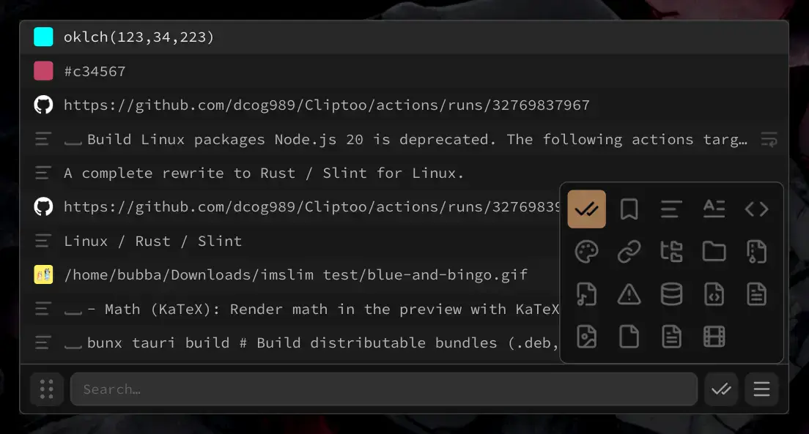

# Cliptoo

Advanced Linux clipboard manager. Use your clip history as a library of things.

Built with Rust / Slint / SQLite, providing small footprint and fast performance.



---

## Features

### Performance

- **Persistent History:** SQLite FTS5 full-text fuzzy search.
- **Fast Search:** Real-time filtering with match highlighting.
- **Virtualized Scrolling:** instant O(1) visible-row rendering regardless of list size.
- **Paste Suppression:** SHA-256 hashing prevents duplicates.

### Clipboard & Paste

- **Clipboard Capture:** Everything you copy is stored, categorised, ready for searching, pasting, previewing.
- **Paste Emulation:** Select clip → Enter → content pasted via `enigo`.
- **Global Hotkeys:** System-wide shortcuts via XDG Portal `GlobalShortcuts`.
- **Quick Paste Overlay:** Just hit the number pad to select and paste.

### Content Intelligence

- **Content-Aware Filtering:** Filter by text, links, images, colors, bookmarks, etc.
- **Image Previews:** Hover thumbnails to preview PNG, JPEG, WebP, AVIF, GIF, JXL, SVG.
- **Color Swatches:** `#hex`, `rgb()`, `hsl()`, `oklch()` - with transparency.
- **Code Highlighting:** Syntax-highlighted editor via `syntect`.
- **URL Metadata:** Auto-fetches page titles and favicons.
- **File Info:** Size, modification date, type classification.

### Organization & Tools

- **Bookmarks:** Make clips permanent, avoid auto-cleanup.
- **Text Transformations:** E.g. `upper`, `lower`, `camel`, `kebab`, `strip whitespace`, etc.
- **"Send To":** Send clips to external programs, text diff tool integration.

### Storage & Maintenance

- **Auto-Cleanup:** Prune by age and / or count.
- **Clear Caches:** Reclaim disk space for thumbnails and metadata.
- **Deadhead:** Remove clips referencing deleted files.
- **Reclassify:** Re-run content classification on stored clips.
- **Export/Import:** Portable JSON backup and restore.
- **DB Statistics:** Total clips, paste count, database size.

### Customisation

- **Theming:** Light/Dark/System, custom accent color.
- **Typography:** Font family, size, row padding.

### System Integration

- **System Tray:** Close to tray.

## Tech Stack

| Component           | Technology                                |
|---------------------|-------------------------------------------|
| Language            | Rust (edition 2024)                       |
| UI Framework        | Slint 1.17 (Qt 6 backend)                 |
| Window System       | Wayland (wlr-data-control, KDE Plasma 6)  |
| Database            | SQLite + FTS5 (`rusqlite`)                |
| Async Runtime       | Tokio                                     |
| Image Processing    | `image`, `resvg`, `jxl-oxide`             |
| Syntax Highlighting | `syntect`                                 |
| Colour Science      | Custom OKLCH→sRGB (Björn Ottosson spec)   |
| D-Bus / Portals     | `zbus`                                    |
| System Tray         | D-Bus StatusNotifierItem via `zbus`       |
| Input Emulation     | `enigo`                                   |
| HTTP Client         | `reqwest` (rustls)                        |

### LLM Use

Large Language Models (LLMs) were used to assist with code generation, refactoring, and documentation. All AI output was subject to human code review, automated testing, manual testing, and adversarial reviews.

---

## Installation

Cliptoo runs on **Wayland** (KDE Plasma 6). Keep `xdg-desktop-portal-kde` installed so global shortcuts work.

Prebuilt AppImage, `.deb`, `.rpm`, and `.pkg.tar.zst` bundles are on the [releases page](https://github.com/dcog989/Cliptoo/releases).

### AppImage

Download `cliptoo-<version>-x86_64.AppImage` from the [releases page](https://github.com/dcog989/Cliptoo/releases), then:

```sh
chmod +x cliptoo-*-x86_64.AppImage
./cliptoo-*-x86_64.AppImage
```

To add it to your application menu and file associations, use [AppImageLauncher](https://github.com/TheAssassin/AppImageLauncher) or [GearLever](https://github.com/mijorus/gearlever).

### Debian / Ubuntu

```sh
sudo apt install ./cliptoo_*_amd64.deb
```

### Fedora / RHEL

```sh
sudo dnf install ./cliptoo-*.x86_64.rpm
```

### Arch Linux

Install a prebuilt package from the [releases page](https://github.com/dcog989/Cliptoo/releases):

```sh
sudo pacman -U cliptoo-*.pkg.tar.zst
```

Or build and package the local release binary:

```sh
make package
sudo pacman -U .pkg/cliptoo-*.pkg.tar.zst
```

### From source

See [Prerequisites](#prerequisites).

```sh
make install
```

---

## Development

### Prerequisites

- **Rust toolchain** (stable): `curl --proto '=https' --tlsv1.2 -sSf https://sh.rustup.rs | sh`
- **Qt 6 + Wayland dev headers:**

| Distro       | Command                                                                     |
|--------------|-----------------------------------------------------------------------------|
| Debian/Ubuntu| `sudo apt install qt6-base-dev qt6-wayland libwayland-dev libxkbcommon-dev pkg-config` |
| Fedora       | `sudo dnf install qt6-qtbase-devel qt6-qtwayland libwayland-devel libxkbcommon-devel pkgconfig` |
| Arch         | `sudo pacman -S qt6-base qt6-wayland wayland wayland-protocols libxkbcommon pkgconf` |

### Build & Run

```sh
git clone https://github.com/dcog989/cliptoo.git && cd cliptoo
```

```sh
cargo install cargo-outdated        # initialize outdated tool

cargo build                         # debug build
cargo check                         # type-check only
cargo clippy --workspace --all-targets -- -D warnings
cargo fetch && cargo outdated -w    # check for updates above semver range
cargo fmt --check                   # formatting check
cargo fmt                           # format all files
cargo run                           # build and run
cargo test --workspace              # tests
cargo upgrade && cargo update --verbose # update Cargo.lock and dependencies to latest with semver ranges

cargo clean && rm -rf target/       # clean build artifacts
```

### Release

Releases use [Cocogitto](https://cocogitto.io/) (`cargo install cocogitto` / `sudo pacman -S cocogitto`), configured in `cog.toml`.

```sh
cog bump --auto               # bump version, sync manifests, write `CHANGELOG.md`, commit, tag, push
cog bump --version V=1.23.4   # Manual version
cog changelog                 # Changelog preview
```

Commits must use [Conventional Commits](https://www.conventionalcommits.org/) — enforced on commit via `cog verify`.

---

## License

GNU General Public License v3
